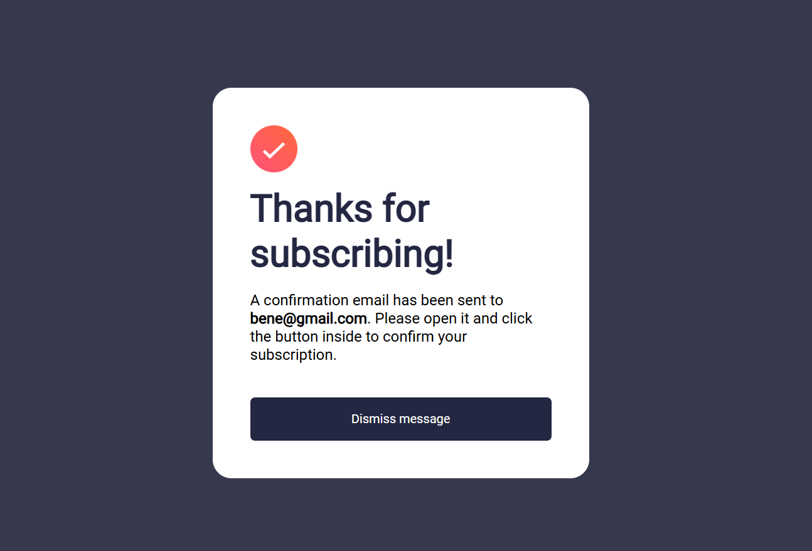
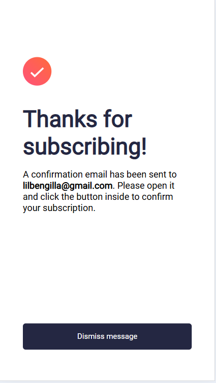

# Newsletter sign-up form with success message
This is a solution to the [Newsletter sign-up form with success message challenge on Frontend Mentor](https://www.frontendmentor.io/challenges/newsletter-signup-form-with-success-message-3FC1AZbNrv). This challenge helped enhance my HTML, CSS, and JavaScript skills by building a realistic and functional project.

## Table of contents
- [Overview](#overview)
  - [The challenge](#the-challenge)
  - [Screenshot](#screenshot)
  - [Links](#links)
- [My process](#my-process)
  - [Built with](#built-with)
  - [Features](#features)
  - [What I learned](#what-i-learned)
  - [Continued development](#continued-development)

## Overview
### The challenge
Users should be able to:
- Enter their email and submit the form
- See a success message with their email after successfully submitting the form
- See form validation messages if:
  - The field is empty
  - The email address is not formatted correctly
- View the optimal layout for the interface depending on their device's screen size
- See hover and focus states for all interactive elements on the page

### Screenshot
- Desktop view





- Mobile view




### Links
- Solution URL: [Add solution URL here]()
- Live Site URL: [Add live site URL here]()

## My process
### Built with
- HTML5
- CSS
- JavaScript for interactivity and dynamic content updates

### Features
- Responsive Design:
  - Fully responsive for desktop and mobile users.
  - Utilizes media queries for smooth layout adjustments.

- Email Validation:
  - Validates the email field to ensure it's not empty and follows a proper email format.
  - Displays error messages for invalid input.

- Displays the user's entered email in bold within the success message.

- A "Dismiss message" button allows users to reset the form and return to the sign-up view.
  
- Interactive hover states for buttons to improve user experience.

### What I learned
- Dynamic Content Injection: Used JavaScript to dynamically update text on the success screen.
```js
const email = emailInput.value;
userEmailDisplay.textContent = email;
```

- Responsive Design Techniques: Applied @media queries to handle layout changes for different screen sizes.

```css
@media (max-width: 768px) {
  .container {
    flex-direction: column-reverse;
  }
}
```

- Form Validation: Implemented basic email validation using JavaScript to improve user experience.

- CSS Hover States: Enhanced button interactivity with hover effects and transitions.
```css
button:hover {
  background-color: hsl(4, 100%, 67%);
  transition: all 0.3s;
}
```

### Continued development
- Add Server-Side Validation:
  - Implement a backend to process the form data securely.

- Improve Error Handling:
  - Add more descriptive error messages for invalid inputs.